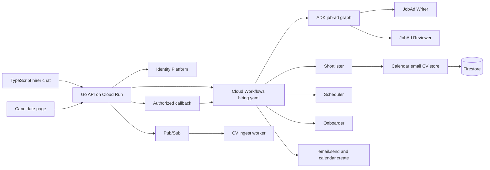

# Architecture

The hirer chat and the candidate page are static TypeScript, served by the Go API. Python runs the agents, the guardrails, and the local step runner. `workflow/hiring.yaml` is the Cloud Workflows lifecycle. The runner stores the same step ids and does not evaluate the YAML.

Cloud Run, Firestore, Pub/Sub, Workflows, and Vertex stay in `australia-southeast1`. Identity Platform is global and sees the account email, not CVs. Terraform for that layout is in `infra/terraform`. It was not applied from this machine.

Locally, `ENV=local` uses two fixed users and an in-memory runner. A seed email with no Identity Platform token returns 404 when `ENV` is anything else. Cloud sign-in posts an ID token; `GET /config` tells the page which button to show. The session cookie is HMAC-signed, so the API can scale to zero. A browser cookie cannot call `/execute` or `/callbacks`. In cloud mode the API starts a Workflows execution and sends the stored callback URL. That URL is absent from the workflow view. Hire state is the Firestore document `runtime/state` when `FIRESTORE_PROJECT` is set. The agent service stays at one instance so that snapshot is not split across processes. Chat transcripts stay in the API process.
